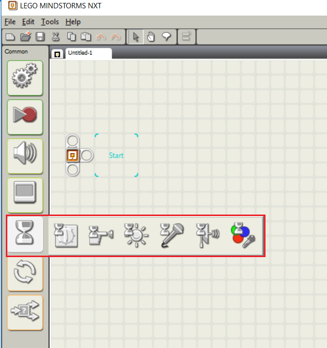

<h1>Sistema didattico per NXT</h1>
<h4>Matteo Forni e Bryan Beffa</h4>

1. [Introduzione](#introduzione)

  - [Informazioni sul progetto](#informazioni-sul-progetto)

  - [Abstract](#abstract)

  - [Scopo](#scopo)

1. [Analisi](#analisi)

  - [Analisi del dominio](#analisi-del-dominio)

  - [Analisi e specifica dei requisiti](#analisi-e-specifica-dei-requisiti)

  - [Pianificazione](#pianificazione)

  - [Analisi dei mezzi](#analisi-dei-mezzi)

1. [Progettazione](#progettazione)

  - [Design dell’architettura del sistema](#design-dell’architettura-del-sistema)

1. [Implementazione](#implementazione)

  - [Libreria wait](#libreria-wait)

  - [LineFollower](#LineFollower)

1. [Test](#test)

  - [Protocollo di test](#protocollo-di-test)

  - [Risultati test](#risultati-test)

  - [Mancanze/limitazioni conosciute](#mancanze/limitazioni-conosciute)

1. [Consuntivo](#consuntivo)

1. [Conclusioni](#conclusioni)

  - [Sviluppi futuri](#sviluppi-futuri)

  - [Considerazioni personali](#considerazioni-personali)

1. [Bibliografia](#bibliografia)

    - [Sitografia](#sitografia)


1. [Allegati](#allegati)

<div style="page-break-after: always;"></div>

## Introduzione

### Informazioni sul progetto

  -   Allievi: Matteo Forni e Bryan Beffa

  -   Docenti: Luca Muggiasca, Francesco Mussi, Adriano Barchi, Massimo Sartori

  -   SAM Trevano, Informatica, I3AA

  -   14.11.2018 - 01.02.2018


### Abstract

  > *The project requirement is to create a java and a robotC library.
  > In these libraries, we have to put some useful classes for the guys of
  > the second year. These classes will be used for the WRO, so they will
  > have some methods for every actuator and sensor. These libraries should be
  > universal and user-friendly, so the guys could use it in a
  > simple way for their interests.*

### Scopo

<div style="text-align:justify">

Lo scopo di questo progetto è quello di creare due librerie, una in RobotC e l'altra in Java sia per bricks EV3 sia per NXT, per aiutare gli allievi del secondo anno di informatica che parteciperanno alla gara di robotica WRO. Esse permetteranno di eseguire le operazioni basilari con i motori
e con i seguenti sensori:

</div>

  - Sensore tattile

  - Sensore di luce/colore

  - Giroscopio

  - Sensore ad ultrasuoni

  - Sensore di suono

<div style="text-align:justify">

Al termine della creazione delle librerie dovrà essere eseguito un test di performance
per determinare quale tra le due librerie funziona meglio.

</div>

## Analisi

### Analisi del dominio

<div style="text-align:justify">

La scuola necessita di una libreria per gli allievi di informatica del secondo anno, essa servirà a controllare i robot Ev3 e NXT durante la competizione di robotica WRO. La libreria dovrà contenere del codice per il controllo degli attuatori e dei sensori così da aiutare l’utente con l’uso dei Robot Mindstorm, essa dovrà essere scritta in RobotC e in Java e dovrà poi venire valutato quale dei due linguaggi è il migliore e più performante. La libreria dovrà essere di facile comprensione e modifica per gli allievi, dovrà quindi comprendere una guida all’utilizzo.
Attualmente, per i ragazzi del secondo anno, non ci sono altri prodotti che svolgono questo compito. Le conoscenze che saranno necessarie per utilizzare il prodotto saranno quelle di base della programmazione.

</div>

### Analisi e specifica dei requisiti

<div style="text-align:justify; margin-bottom:15px;">

Il committente necessita di librerie utili per l’utilizzo dei robot LEGO
Mindstorm. Le librerie devono contenere metodi utili per ogni
sensore/attuatore. Queste librerie devono essere scritte in RobotC e
java. I metodi devono essere di facile utilizzo (user-friendly) e
dovranno essere compatibili con robot di diverse forme e dimensioni.
Per ogni attuatore/sensore sono disponibili più metodi che effettuano
azioni distinte. Queste librerie servono per aiutare gli allievi del
secondo anno durante la WRO.


</div>

  |ID  |REQ-01                                         |
  |----|------------------------------------------------|
  |**Nome**    |Classe sensore ultrasuono Java |
  |**Priorità**|1                              |
  |**Versione**|2.0                            |
  |**Note**    |Il requisito è stato eliminato. |

  |ID  |REQ-02                                         |
  |----|------------------------------------------------|
  |**Nome**    |Classe sensore di colore Java  |
  |**Priorità**|1                              |
  |**Versione**|2.0                            |
  |**Note**    |Il requisito è stato eliminato.  |

  <div style="page-break-after: always;"></div>

  |ID  |REQ-03                                         |
  |----|------------------------------------------------|
  |**Nome**    |Classe sensore di tatto Java   |
  |**Priorità**|1                              |
  |**Versione**|2.0                            |
  |**Note**    |Il requisito è stato eliminato.   |

  |ID  |REQ-04                                         |
  |----|------------------------------------------------|
  |**Nome**    |Classe sensore giroscopio Java |
  |**Priorità**|1                              |
  |**Versione**|2.0                            |
  |**Note**    |Il requisito è stato eliminato.|

  |ID  |REQ-05                                         |
  |----|------------------------------------------------|
  |**Nome**    |Classe sensore di luce Java|
  |**Priorità**|1                              |
  |**Versione**|2.0                            |
  |**Note**    |Il requisito è stato eliminato. |

  |ID  |REQ-06                                         |
  |----|------------------------------------------------|
  |**Nome**    |Classe motore principale Java |
  |**Priorità**|1                              |
  |**Versione**|2.0                            |
  |**Note**    |Il requisito è stato eliminato. |

  |ID  |REQ-07                                         |
  |----|------------------------------------------------|
  |**Nome**    |Classe motore secondario Java |
  |**Priorità**|1                              |
  |**Versione**|2.0                            |
  |**Note**    |Il requisito è stato eliminato. |

  |ID  |REQ-08                                         |
  |----|------------------------------------------------|
  |**Nome**    |Classe sensore di suono Java|
  |**Priorità**|1                              |
  |**Versione**|2.0                            |
  |**Note**    |Il requisito è stato eliminato.|

<div style="page-break-after: always;"></div>

  |ID  |REQ-09                                         |
  |----|------------------------------------------------|
  |**Nome**    |Libreria wait|
  |**Priorità**|1                              |
  |**Versione**|1.0                            |
  |**Note**    |Libreria che riporta i metodi del blocchetto wait del linguaggio visivo di NXT.|
  |            |**Sotto requisiti** |
  |**001**      |Metodo di attesa del suono.|
  |**002**      |Metodo di attesa della distanza rilevata con l'ultrasuoni.|
  |**003**      |Metodo di attesa del tocco.|
  |**004**      |Metodo di attesa della luce.|
  |**005**      |Metodo di attesa di un lasso di tempo.|
  |**006**      |Metodo di attesa del movimento in rotazioni dei motori.|
  |**007**      |Metodo di attesa del movimento in gradi dei motori.|

  |ID  |REQ-10                                         |
  |----|------------------------------------------------|
  |**Nome**    |Progetto di dimostrazione e test|
  |**Priorità**|1                              |
  |**Versione**|1.0                            |
  |**Note**    |Mini progetto che dimostra l'uso della libreria e ne testa il funzionamento.|
  |            |**Sotto requisiti** |
  |**001**      |Line follower percentuale.|
  |**002**      |Controllo della presenza di oggetti davanti a se.|


### Pianificazione

<div style="text-align:justify">

Qui di seguito si può vedere il Gantt iniziale, nell'immagine si nota come era stato pensato di suddividere i metodi di entrambi i linguaggi fra i due componenti del gruppo e come questa parte fosse stata stimata come la più lunga del progetto. In questa progettazione non era presente nemmeno il programma dimostrativo.

</div>


<div style="page-break-after: always;"></div>

### Analisi dei mezzi

#### Software

<div style="text-align:justify">

I software che sono stati utilizzati sono i seguenti:

</div>

- LEGO Mindstorm NXT
- RobotC IDE

#### Hardware

<div style="text-align:justify">

In questo progetto è stato utilizzato il seguente hardware:

</div>

- Portatili (specifiche tecniche nella media) con Windows 10
- Robot Lego NXT brick
- Sesore di luce
- Sensore ultrasuono
- Sensore di tatto
- Motore principale
- Motore secondario

## Progettazione

<div style="text-align:justify; margin-bottom:10px;">

Durante i colloqui con i docenti l'idea di base del progetto è cambiata. Con i vari gruppi ci siamo suddivisi i compiti così che noi dobbiamo fare solamente una libreria scritta in RobotC. Questa libreria dovrà contenere i metodi di attesa del blocchetto del linguaggio visivo di NXT. Dovrà inoltre venire fatto un programma di esempio per dimostrare l'utilizzo dei metodi così come il loro funzionamento.
La libreria da creare dovrà contenere sette metodi complementari a quelli del blocchetto wait del linguaggio visivo NXT, mostrati nella foto seguente, senza il metodo di riconoscimento del colore che non viene scritto dato che i sensori non possono distinguere i colori.

</div>



<div style="text-align:justify; margin-bottom:10px;">

Oltre a ciò la libreria contiene tre metodi che rappresentano i movimenti del motore nelle sue tre opzioni pari a quelle del linguaggio visivo: per rotazioni, per secondi o per gradi.

</div>


<div style="page-break-after: always;"></div>

<div style="text-align:justify">

Come seconda parte del progetto dovrà venire scritto un programma di test di alcuni dei metodi della libreria e del linguaggio RobotC in se così da verificare se esso porta dei vantaggi o meno.
Il programma sarà un line follower proporzionale che si ferma ad una determinata distanza da un oggetto. Il robot avrà due sensori di luce, uno a destra e l'altro a sinistra della linea, ed uno di ultrasuoni che controllerà che non ci siano oggetti davanti a se e se ne rileva fa muovere un terzo motore.    

</div>


### Design dell’architettura del sistema

<div style="text-align:justify">

Qui di seguito si può vedere il diagramma delle classi, in esso vi sono tre classi: la libreria di wait, la classe di test della libreria e la classe che esegue il line follower. Entrambe le due classi utilizzano la libreria.

</div>


## Implementazione

### Libreria wait

<div style="text-align:justify">

La libreria wait, scritta nel linguaggio RobotC, definisce dei metodi d'attesa utili per LEGO Robot NXT.  
I metodi che abbiamo definito sono:

</div>

- waitTouch(int)
- waitLight(int, int, bool)
- waitDistance(int, int)
- waitSound(int, int)
- waitTime(long)
- waitRotations(int, int, int)
- waitDegree(int, int, int)

<div style="page-break-after: always;"></div>

#### waitTouch(int port)

<div style="text-align:justify">

Il metodo d'attesa waitTouch(int port) richiede la porta a cui è collegato il sensore come parametro. Questo metodo attende che il sensore di tatto venga premuto.

Il metodo è molto semplice. Viene dichiarata una variabile booleana che indica se il sensore di tocco è premuto.  
Quando il sensore viene premuto il valore letto dal sensore corrisponde "0" e alla variabile booleana viene assegnato il valore *true* in modo che il ciclo *while* termini.

</div>

```
/**
 * Metodo che attende che il sensore di tatto venga premuto
 *
 * @param port porta a cui è collegato il sensore di tatto
 */
void waitTouch(int port){
	bool isPressed = false;

	while(!isPressed){
		//controllo se il sensore è stato premuto
		if(SensorValue[port] > 0){
			isPressed = !isPressed;
		}
	}
}
```

Esempio di utilizzo:

Quando il sensore di tocco viene premuto il robot NXT  emette un suono.


#### waitLight(int port, int threshold, bool higher)

<div style="text-align:justify">

Il metodo waitLight(int port, int threshold, bool higher) attende che il
sensore di luce rilevi un valore superiore alla
soglia *threshold* se al parametro *higher* è stato assegnato il valore *true*
oppure inferiore alla soglia *threshold* se il parametro *higher* corrisponde a
*false*.

Quando accade una delle due situazioni, la variabile booleana *flag*,
utilizzata per ripetere il ciclo, viene settata a *false* così da terminare
il ciclo.

</div>

```
/**
 * Metodo che attende che il sensore di luce rilevi un valore sotto la soglia desiderata
 *
 * @param port porta a cui è collegato il sensore di luce
 * @param threshold soglia di luce minima/massima
 * @param higher valore booleano che determina se bisognerà attendere un valore superiore o inferiore alla soglia.
 */
bool waitLight(int port, int threshold, bool higher){
	bool flag = true;

	while(flag){
		//controllo che il valore letto del sensore non sia sotto la soglia minima
		if(higher){
			if(SensorValue(port) > threshold){
				flag = !flag;
			}
		}else{
			if(SensorValue(port) < threshold){
				flag = !flag;
			}
		}
	}
}
```
Esempio di utilizzo:

Il robot avanza fino al rilevamento del colore nero.

#### waitDistance(int port, int distance)

<div style="text-align:justify">

Il metodo waitDistance(int port, int distance) attende che venga rilevato, dal sensore di distanza (ultrasuoni), un valore inferiore a quello passato
come parametro *distance*.

Questo metodo viene spesso utilizzato durante il movimento di un robot per
farlo fermare ad una determinata distanza da un oggetto.

Il metodo, ritornando un valore booleano, deve
essere chiamato all'interno di un ciclo così ad ogni ripetizione viene
controllato se la distanza è inferiore o maggiore alla soglia determinata.

</div>

<div style="page-break-after: always;"></div>

```
/**
 * Metodo che attende che il sensore di distanza rilevi una distanza inferiore alla soglia
 *
 * @param port porta a cui è collegato il sensore infrarosso
 * @param distance distanza minima da un oggetto
 * @return se la distanza è inferiore alla soglia
 */
bool waitDistance(int port, int distance){
    //controllo che il valore letto non sia inferiore alla soglia minima
    if(SensorValue(port) <= distance){
      return false;
    }
    return true;
}
```

Esempio di utilizzo:

<div style="text-align:justify">

Il robot avanza fino ad arrivare alla distanza decisa dall'utente da un
oggetto, si ferma, e torna indietro.

</div>

#### waitSound(int port, int threshold)

<div style="text-align:justify">

Questo metodo d'attesa ha lo stesso principio del metodo waitDistance()
con la differenza che termina il ciclo quando il sensore di suono rileva
un valore superiore alla soglia *threshold* passata come parametro.

</div>

```
/**
 * Metodo che attende che il sensore di suono rilevi un suono che supero la soglia desiderata
 *
 * @param port porta a cui è collegato il sensore di suono
 * @param threshold soglia del suono
 */
void waitSound(int port, int threshold){
	bool flag = true;
	while(flag){
		//controllo che il sensore di suono non rilevi un suono che superi la soglia
		if(SensorValue[port] >= threshold){
			flag = !flag;
		}
	}
}
```
Esempio di utilizzo:

Il robot avanza fino a quando rileva un valore superiore alla soglia si ferma.

#### waitTime(long millis)

<div style="text-align:justify">

Il metodo waitTime è molto semplice, attende il tempo in millesecondi passato come
parametro *millis*.

Il codice è molto semplice ed è formato da un solo metodo al suo interno,
abbiamo deciso comunque di inserirlo nella libreria per la sua
completezza generale.

</div>

```
/**
 * Metodo che permette l'attesa di un certo numero di millisecondi
 *
 * @param millis millisecondi di attesa desiderati
 */
void waitTime(long millis){
	//aspetto i millesecondi desiderati
	wait1Msec(millis);
}
```
Esempio di utilizzo:

Il robot emette un suono per 2 secondi.

#### waitRotations(int port, int times, int speed)

<div style="text-align:justify">

Il metodo di attesa waitRotations(int port, int times, int speed) attende
che il motore, collegato alla porta passata come parametro, effettui il
numero di rotazioni specificate alla velocità desiderata.

</div>

```
/**
 * Metodo che attende che il motore passato come parametro svolga il numero di rotazioni desiderato
 *
 * @param port porta a cui è collegato il motore
 * @paaram times rotazioni che il motore deve svolgere
 * @param speed velocità desiderata del motore
 */
void waitRotations(int port, int times, int speed){
	//calcolo il numero di rotazioni in gradi
	int degree = 360*times;
	setMotorTarget(port, degree, speed);
	waitUntilMotorStop(port);
}
```

Esempio di utilizzo:

Il robot deve avanzare di 5 rotazioni del motore.

#### waitDegrees(int port, int deegre, int speed)

<div style="text-align:justify">

Questo metodo attende che il motere, passato come parametro, effettui la rotazione dei gradi specificati come parametro *degree*.

</div>

```
/**
 * Metodo che permette la rotazione del motore del numero di gradi desiderato
 *
 * @param port porta a cui è collegato il motore
 * @param degree gradi di rotazione del motore desiderati
 * @param speed velocità del motore desiderata
 * @param millis millisecondi di attesa per permettere la rotazione dei gradi desiderati (scegliere un valore che permetta la rotazione completa)
 */
void waitDegrees(int port, int degree, int speed){
	setMotorTarget(port, degree, speed);
	waitUntilMotorStop(port);
}
```

Esempio di utilizzo:

Il motore del robot deve effettuare una rotazione di 90°.

### LineFollower

<div style="text-align:justify">

Abbiamo realizzato un line follower utilizzando alcuni dei metodi
che abbiamo definito nella libreria wait.

Il programma esegue un LineFollower proporzionale con l'utilizzo di:
 - due sensori di luce
 - un sensore ultrasuono
 - terzo motore (braccio meccanico)

</div>

#### Descrizione

<div style="text-align:justify">

Il robot deve, dopo che sono stati configurati i valori per il colore
bianco ed il colore nero, seguire  la linea nera.
Se il blocchetto trova un ostacolo ad una distanza,
determinata dall'utente, si ferma
e fa girare il braccio meccanico per poi terminare il programma.

Come prima cosa si setta il colore bianco ed il colore nero
tramite dei metodi che abbiamo creato setWhite() and setBlack().

</div>

<div style="page-break-after: always;"></div>

```
//variabili in cui viene salvato il valore del colore bianco e nero
int white;
int black;

//setto il bianco e il nero
white = setWhite();
black = setBlack();
```

<div style="text-align:justify">

I due metodi sono simili e chiedono all'utente di posizionare il robot sul
 rispettivo colore e premere il tasto descritto per settare il valore.

 </div>

 ```
int setBlack()
{
  int black;
  while (true)
  {
	//stampo sul display
	nxtDisplayCenteredTextLine(1, "Premi la freccia");
	nxtDisplayCenteredTextLine(2, "sinistra per");
	nxtDisplayCenteredTextLine(3, "selezionare");
	nxtDisplayCenteredTextLine(4, "il colore nero");
	//premere il tasto sinistra per selezionare il colore nero
    if (nNxtButtonPressed == 2)
    {
      black = (SensorValue[lightA]+SensorValue[lightB])/2;
      return black;
    }
  }
}
 ```

 Successivamente il robot inizia a svolgere il line follower.

 ```
 while(waitDistance(distance, 20)){
	//margine consentito
	double margin = 1.5;

	//soglia di luce riflessa
	int threshold = 50;

	//calcolo l'errore
	int errorA = SensorValue[lightA] - (white+black)/2;
	int errorB = SensorValue[lightB] - (white+black)/2;

	//calcolo la velocità
	double speedA = errorA * margin;
	double speedB = errorB * margin;

	//setto la velocità al motore collegato alla porta A e alla porta B
	motor[motorB] = speedB+15;
	motor[motorA] = speedA+15;
	waitTime(10);
}
 ```

 <div style="text-align:justify">

Come prima cosa viene definita la variabile *margin* che definisce
la precisione del line follower. Più il valore è alto e più
la variazione di velocità aumenta.

Viene definita una soglia, calcolando semplicemente la media tra il colore
bianco e il colore nero, che serve a calcolare l'errore.

Per calcolare la velocità viene effettuato il calcolo *errorA* e
rispettivamente *errorB* moltiplicato per il *margin*.

Infine viene asseganata ai due motori la velocità calcolata in precedenza
e viene utilizzata l'attesa di 10 millisecondi tramite il metodo
della libreria wait.

</div>

```
while(waitDistance(distance, 20)){
  ...
}
```

<div style="text-align:justify">

All'interno del while vi è il metodo waitDistance (vedi metodo
*waitDistance(int port, int threshold)*) in cui ad ogni ciclo viene
controllato se la distanza minima da un oggetto è rispettata o meno.

Infine se la distanza è inferiore alla soglia il robot fa ruotare di 160
gradi, a velocità di -20, il motore che fa da braccio.

</div>

```
while(waitDistance(distance, 20)){
  ...
}

motor[motorB] = 0;
motor[motorA] = 0;

//muovo il motore secondario
waitDegrees(motorC, 160, -20);

```

## Test

### Protocollo di test

|Test Case      | TC-001                               |
|---------------|--------------------------------------|
|**Nome**       |Test di funzionamento della libreria di wait|
|**Riferimento**|REQ-09                               |
|**Descrizione**|Bisogna testare il corretto funzionamento della libreria di wait. |
|**Prerequisiti**|Bisogna avere il robot con il firmware di robotc installato, collegato al PC con i sensori e/o gli attuatori necessari collegati ad esso. |
|**Procedura**     | Bisognerà aprire la classe di test TestLibrary.c e, per ogni metodo della libreria Wait.h, Bisognerà collegare al robot i sensori/attuatori giusti, decommentare il metodo di test ed eseguirlo. Se il robot attende la soglia o il valore atteso allora il metodo richiamato funzionerà correttamente  |
|**Risultati attesi** |Con tutti i metodi richiamati il robot dovrebbe attendere il valore o la soglia e poi terminare il programma. |

|Test Case      | TC-002                               |
|---------------|--------------------------------------|
|**Nome**       |Test di funzionamento del line follower proporzionale|
|**Riferimento**|REQ-10                               |
|**Descrizione**|Bisogna testare se la classe LineFollower.c funziona correttamente. |
|**Prerequisiti**|Si necessita di avere un robot con il firmware di robotc installato e con collegati due sensori di luce e uno di ultrasuoni. |
|**Procedura**     | Bisognerà compilare il codice dall'ambiente di sviluppo di robotc sul robot appositamente collegato al computer. Fatto ciò si eseguirà il programma, si seguiranno le istruzioni stampate a schermo ed infine si posizionerà il robot sopra una linea nera.   |
|**Risultati attesi** |Il robot dovrebbe iniziare a seguire la linea nera. |


### Risultati test

|Risultati dei test |                   |                |
|-------------------|-----------------------------------|
|**Test case**      |**Risultato**      |**Note**       |
|TC-001             |successo           |-              |
|TC-002             |successo           |-              |


### Mancanze/limitazioni conosciute

Il progetto presenta alcune limitazioni che però sono date dall'hardware e non dalla libreria che abbiamo creato. La precisione dei sensori è approssimativa e può capitare che le letture dei vari sensori non corrispondano al valore reale. Abbiamo inoltre notato che il sensore ultrasuono, se non si lascia una distanza minima adeguata (5 - 6 centimetri), non riesce a misurare il percorso che intercala tra esso e l'ostacolo.

## Consuntivo

Come si può notare


## Conclusioni

Questa soluzione certamente non cambierà il mondo ma superiamo che possa però essere d'aiuto ai ragazzi di seconda durante le loro competizioni. Personalemente lo riteniamo un successo perché, anche se l'obiettivo di questo progetto non era quello di diventare qualcosa di rivoluzionario ma qualcosa da utilizzare per facilitarsi la vita e velocizzare la scrittura del codice, esso fa esattamente quello per cui era stato pensato.

### Sviluppi futuri
  Migliorie al prodotto si possono fare aggiungendo dei metodi che svolgono programmi più complessi magari aspettando delle combinazioni di sensori ma non sappiamo se questo potrebbe tornare utile e se esso fosse necessario può essere facilmente sviluppato dagli allievi interessati.

### Considerazioni personali
  Da questo progetto abbiamo imparato che ci sono svariati linguaggi di programmazione marginali, ma che se conosciuti possono aiutare con cose che se sviluppate senza di essi risultano complicate. Noi personalmente, anche se siamo sempre stati scettici dell'utilità del prodotto finale, siamo soddisfatti dai risultati ottenuti.

## Bibliografia

### Sitografia

-   http://www.robotc.net/forums/viewtopic.php?f=1&t=19568, *RobotC Forum*, 21.11.2018.

-   https://www.dexterindustries.com/howto/using-debugger-stream-in-robotc-for-lego/, *RobotC debug stream*, 30.11.2018

-   http://www.robotc.net/forums/viewtopic.php?f=1&t=7556, *RobotC buttons handling*, 12.12.2018.

-   http://www.robotc.net/wikiarchive/NXT_Functions_Display, *RobotC display functions Manual*, 17.12.2018.

-   http://www.robotc.net/forums/viewtopic.php?f=52&t=5916, *RobotC pragma manual*, 19.12.2018.

-   http://help.robotc.net/WebHelpVEX/index.htm#Resources/topics/VEX_IQ/ROBOTC/Motor_Commands/setMotorTarget.htm, *Move motor with degrees*, 09.01.2019.

-   https://gist.github.com/dhmmjoph/f63a002bde9409bbff97, *Proportional line follower*, 16.01.2018.

-   http://ev3lessons.com/en/ProgrammingLessons/advanced/LineFollower.pdf, *Proportional line follower*, 16.01.2018.

-   https://stackoverflow.com/questions/14675913/changing-image-size-in-markdown, *Markdown images*, 23.01.2018.

-   https://stackoverflow.com/questions/22601053/pagebreak-in-markdown-while-creating-pdf, *Markdown page break*, 30.01.2019.

## Allegati

-   Diari di lavoro

-   Istruzioni di installazione del firmware

-   Libreria di wait

-   Programma dimostrativo
